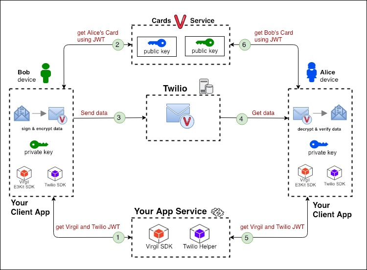

# Add End-to-End Encryption to your Twilio Product using E3kit
In this tutorial, we will help you add end-to-end encryption to your product to secure your messages and user data that you deliver using Twilio Programmable Chat.

### How Does End-to-End Encryption Work?
End-to-end encryption consists of securing data between two users or endpoints using a private & public key for each user or endpoint:

<a href="https://virgilsecurity.com"></a>

- The public key is published to Virgil Cards Service, part of the Virgil Cloud PKI. When your users want to send a message, the Virgil SDK uses the recipient's public key to encrypt the message data in a way that only the recipient's corresponding private key can decrypt it.
- The private key is kept on the end-user's device, enabling the user and only the user to decrypt any messages or data that other users sent to them. It's similar to the relationship between a public mailing address and a private mailbox. You look up someone's address to send them a letter, but only they can unlock their mailbox to open and read the letter.

The address book (Virgil's Cards Service), mailing address (public key) and mailbox key (private key) are related to each other, but can't be traced to each other in any way that would compromise the security of the system. End-to-end encryption also locks the letter (message data), and only the recipient has the key to unlock it.

This setup enables users to encrypt a message on their phone or computer, send it over the Internet to a recipient without any chance of another party reading it in transit or on the server, and have it be decrypted only by the recipient on their phone or computer. This all works seamlessly for the end-users and it only takes a few lines of code to implement using e3kit SDK.


# Get Started

## Step 1: Set Up Your Backend
We assume that you already have a Twilio Project. If you don't, please create one now. Also, we assume that you have a basic backend server for your app. Your server must be able to create and store user records in persistent storage and provide a user authentication strategy, whether that's a simple username/password or a third-party provider like GitHub or Facebook.

### Provide your users access to Virgil Cloud
To make API calls to the Virgil Cloud, you'll need to provide the users of your app with a JWT that contains the user's `identity` which is a string that uniquely identifies each user in your application. For this tutorial we'll assume that your user records have a unique ID assigned by the database, known as `uid`, and we will use that as their `identity`.

> You can use any string value for the user identity as long as it's unique for each user. For security reasons, avoid using fields that contain any personally identifiable information such as name or email address, especially if your product needs to comply with regulations such as HIPAA and GDPR.

JWTs must be generated on the server-side for several reasons:
- each JWT must be signed with your Virgil API Key to prove it was issued by you,
- the client side should not have access to your sensitive API Key and
- you need to authenticate the user making the request to get their identity.

> JWT grants access to Virgil Cloud for a specific Virgil Application. Each JWT grants a user access to the Virgil Cloud for a specific Virgil Application and has a limited lifetime that is configured by you. However, best practice is to generate a JWT for the shortest amount of time feasible for your application. If you need more details about the structure of a JWT, please take a look at this article.

### Generate JWT 

In order to have a possibility to encrypt/decrypt messages and use a Twilio Programmable Chat, your users have to be authenticated using JWT at Virgil and Twilio services. So, you need a backend code that generates Virgil and Twilio JWTs. 

For this tutorial we've created a sample backend code that demonstrates how to combine Virgil and Twilio JWT generation. To setup and run the sample backend locally, head over to [Twilio-Sample-Backend-NodeJS](https://github.com/VirgilSecurity/twilio-sample-backend-nodejs) GitHub repo and follow the instructions in README.

## Step 2: Set Up Your Client
On the client side we will use the `e3kit` SDK to create and store the user's private key on their device and publish the user's corresponding public key in the Virgil Cloud.

### Install e3kit
Use your package manager to download the e3kit SDK into your mobile or web project.

```shell
npm install -S @virgilsecurity/e3kit
```

### Initialize e3kit
In order to interact with the Virgil Cloud, the e3kit SDK must be provided with a callback that it will call to fetch the Virgil JWT from your backend for the current user.

```javascript
import { EThree } from '@virgilsecurity/e3kit';

// This function returns a token that will be used to authenticate requests
// to your backend.
// This is a simplified solution without any real protection, so here you need use your
// application authentication mechanism.
async function authenticate(identity) {
    const response = await fetch('http://localhost:3000/authenticate', {
        method: 'POST',
        headers: {
            'Content-Type': 'application/json',
        },
        body: JSON.stringify({
            identity: identity
        })
    });
    if (!response.ok) {
        throw new Error(`Error code: ${response.status} \nMessage: ${response.statusText}`);
    }

    return response.json().then(data => data.authToken);
}

// Log in as `alice`
const eThreePromise = authenticate('alice').then(authToken => {
    // E3kit will call this callback function and wait for the Promise resolve.
    // When it receives Virgil JWT it can do authorized requests to Virgil Cloud.
    // E3kit uses the identity encoded in the JWT as the current user's identity.
    return EThree.initialize(getVirgilToken);

    // This function makes authenticated request to GET /virgil-jwt endpoint
    // The token it returns serves to make authenticated requests to Virgil Cloud
    async function getVirgilToken() {
        const response = await fetch('http://localhost:3000/virgil-jwt', {
            headers: {
                // We use bearer authorization, but you can use any other mechanism.
                // The point is only, this endpoint should be protected.
                Authorization: `Bearer ${authToken}`,
            }
        })
        if (!response.ok) {
            throw new Error(`Error code: ${response.status} \nMessage: ${response.statusText}`);
        }

        // If request was successful we return Promise which will resolve with token string.
        return response.json().then(data => data.virgilToken);
    }
});

// then you can get instance of EThree in that way:
eThreePromise.then(eThree => { /* eThree.encrypt/decrypt/lookupPublicKeys */})
// or
const eThree = await eThreePromise;
```


The `EThree.initialize()` function gets the user's JWT, checks whether a user already has a private key saved in local storage and a published public key on Virgil Cloud. The `EThree.initialize()` function must be used on SignUp and SignIn flows.


## Step 3: Register Users on Virgil Cloud
User Registration on Virgil Cloud consists of generating a public-private keypair for a user, saving the private key on their device and publishing the public key on the Virgil Cloud (for other users to reference).


To register users on Virgil Cloud you have to use `EThree.register()` method during the Sign Up flow in your application:

```javascript
// TODO: initialize

await eThree.register();
// or
eThree.register()
    .then(() => console.log('success'))
    .catch(e => console.error('error: ', e));
```
There is no need to use `EThree.register()` method on Sign In flow.


## Step 4: Sign and Encrypt Data
As previously noted, we encrypt data to hide the message's real content from other parties. But a recipient also needs to be sure that a third party has not modified the message's content and that the message actually came from the expected, authorized sender. So, in addition to encrypting message data for data security, e3kit uses digital signatures to verify data integrity.


`eThree.encrypt(data, publicKeys)` signs the data with the sender's private key and encrypts the message for recipients' public keys.

The publicKeys parameter is an array of the recipients' public keys. In order to retrieve the public keys of users using their identities and generate this array, you'll need to use the `eThree.lookupPublicKeys(identities)` method.

```javascript
// TODO: initialize and register user (see EThree.initialize and EThree.register)

// aliceUID and bobUID - strings with identities of users that receive message
const usersToEncryptTo = [aliceUID, bobUID];

// Lookup user public keys
const publicKeys = await eThree.lookupPublicKeys(usersToEncryptTo);

// Encrypt data using target user public keys
const encryptedData = await eThree.encrypt(new ArrayBuffer(), publicKeys);

// Encrypt text using target user public keys
const encryptedText = await eThree.encrypt('this text will be encrypted', publicKeys);
```

> Multiple recipients: one ciphertext. Even if a message is sent to multiple recipients, the resulting ciphertext (or encrypted data) will be a single blob/string that all users in the recipient list can decrypt.


## Step 5: Decrypt Data and Verify Signature
Now let's decrypt the data, then verify that they came from the correct, expected sender.

`eThree.decrypt(data, publicKey)` decrypts the data using the recipient's private key (remember that the sender looked up the recipient's public key and encrypted the message so that only the recipient's corresponding private key could decrypt the message). It also verifies the authenticity of the decrypted data with the publicKey parameter, by confirming that the public key on the message signature is the public key of the expected sender.

```javascript
// TODO: initialize SDK and register users - see EThree.initialize and EThree.register

// bobUID - string with sender identity
// Lookup origin user public keys
const publicKey = await eThree.lookupPublicKeys(bobUID);

// Decrypt data and verify if it was really written by Bob
const decryptedData = await eThree.decrypt(encryptedData, publicKey);

// Decrypt text and verify if it was really written by Bob
const decryptedText = await eThree.decrypt(encryptedText, publicKey);
```

# What's Next?

## Sign in from multiple devices

When users Sign Up at your server side, they use your client-application on their specific device (phone, laptop etc.), but further, probably users will be able to Sign In to your application from multiple devices/browsers.

There are two ways to manage users with e3kit:
- **single-device use**: your users will only be able to access encrypted messages or data from a single device (smartphone or browser)
- **multi-device use**: your users will be able to access encrypted messages or data from multiple devices (both smartphone and browser)

> Note that different browsers on the same physical device are also considered different "devices".

To enable multi-device use in your application:

- **first**, use the `eThree.backupPrivateKey(pwd)` function to set a backup password and upload the encrypted private key to the cloud. The function must be called from the device that the user initially used to register his/her public key.

```javascript
// TODO: initialize and register user (see EThree.initialize and EThree.register)

await eThree.backupPrivateKey(keyPassword);
// or
eThree.backupPrivateKey(keyPassword)
    .then(() => console.log('success'))
    .catch(e => console.error('error: ', e));
```

- **second**, on each new device use the `EThree.restorePrivateKey(pwd)` method to download the user's private key from the cloud and decrypt it:
```javascript
// TODO: initialize, register user and backup private key
// (see EThree.initialize, EThree.register and EThree.backupPrivateKey)

const hasPrivateKey = await eThree.hasPrivateKey();

if (!hasPrivateKey) await eThree.restorePrivateKey(keyPassword);
// or
eThree.hasPrivateKey().then(hasPrivateKey => {
    if (!hasPrivateKey) eThree.restorePrivateKey(keyPassword);
});
```

If you are not sure whether the user is using the original device or a new device, you can use `eThree.hasPrivateKey()` method to check if the user's private key already exists on the device. If the user's private key is indeed present on the device, then you can encrypt/decrypt data. Otherwise use the `EThree.restorePrivateKey(pwd)` method to access the user's private key using their backup password.


>  **How strongly are my users' private keys protected in the cloud?** We know it might seem counter-intuitive to allow a private key off your users' devices. But it's actually quite safe. The function uses elliptic curve BLS12-381 (built by the zCash cryptocurrency team) to derive a 128-bit strong key from the password specified. This key is used to encrypt your user's private key before e3kit saves it in the Virgil Cloud.

## Rotate User Keys

Use this flow when a user's public key was published, but the private key has been lost (became not valid). The `EThree.rotatePrivateKey() method publishes a new public key and marks the previous public key as outdated.

```javascript
Copy
// TODO: initialize and register user (see EThree.initialize and EThree.register)

await eThree.rotatePrivateKey();
// or
eThree.rotatePrivateKey()
    .then(() => console.log('success'))
    .catch(e => console.error('error: ', e));
```

> If a user loses their private key before making a backup, they won't be able to decrypt previously encrypted data.

## Change Backup Password

When user wants to change the password that was used to back up their private key, use the `EThree.changePassword(pwd)` method to re-encrypt the user's private key on their device with the new password, and then upload it to the Virgil Cloud.

```javascript
Copy
// TODO: initialize and register user (see EThree.initialize and EThree.register)

await eThree.changePassword(oldPassword, newPassword);
// or
eThree.changePassword(oldPassword, newPassword)
    .then(() => console.log('success'))
    .catch(e => console.error('error: ', e));
```

## Reset User Key

To delete a user's encrypted private key from Virgil Cloud, use the `EThree.resetPrivateKeyBackup(pwd)` method:
```javascript
// TODO: initialize, register user and backup private key
// (see EThree.initialize, EThree.register and EThree.backupPrivateKey)

await eThree.resetPrivateKeyBackup(keyPassword)
// or
eThree.resetPrivateKeyBackup(keyPassword)
    .then(() => console.log('success'))
    .catch(e => console.error('error: ', e));
```

## Clean Up Device

To delete a user's private key from their device use the `EThree.cleanUp()` method:
```javascript
// TODO: initialize and register user (see EThree.initialize and EThree.register)

await eThree.cleanup();
// or
eThree.cleanup()
    .then(() => console.log('success'))
    .catch(e => console.error('error: ', e));
```

> When you want to clean up a user key be sure that you made its backup.
